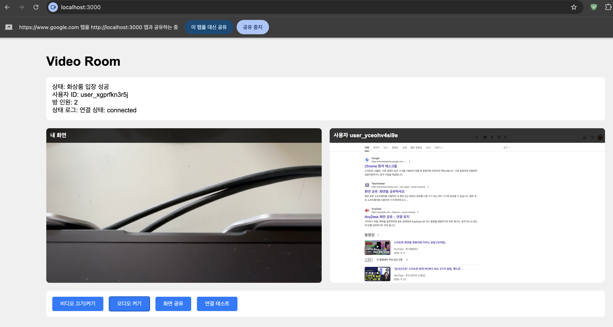
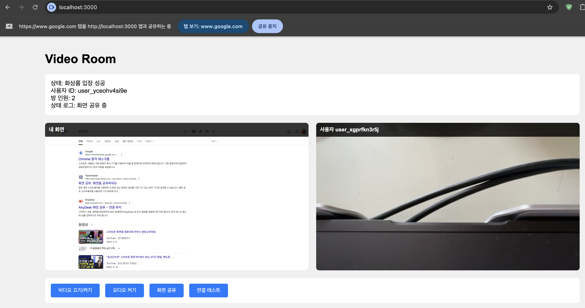

# V-Room - 실시간 화상룸 애플리케이션




## 📖 프로젝트 소개

Nest.js, WebRTC, socket.io 기반으로 실시간 화상룸 기능을 구현한 샘플 프로젝트

### ✨ 주요 기능

- 🎥 **실시간 화상 통화**: WebRTC를 통한 고품질 화상 통화
- 🎤 **음성/비디오 제어**: 마이크와 카메라를 개별적으로 켜고 끌 수 있음
- 📺 **화면 공유**: 데스크톱 화면을 다른 참가자들과 공유
- 👥 **다중 사용자 지원**: 여러 사용자가 동시에 참여 가능
- 🔄 **실시간 연결**: Socket.IO를 통한 실시간 사용자 상태 동기화

### 🛠 기술 스택

- **Backend**: NestJS, Socket.IO, gRPC
- **Frontend**: Vanilla JavaScript, WebRTC
- **통신**: WebRTC (P2P), Socket.IO (시그널링)

## 🚀 프로젝트 구동 방법

### 1. 의존성 설치

```bash
yarn install
```

### 2. 로컬 서버 실행

```bash
yarn start
```

### 3. 브라우저에서 접속

```
http://localhost:3000
```

## 📱 사용 방법

1. **방 입장**: 페이지 로드 시 자동으로 방에 입장됩니다
2. **카메라/마이크 권한**: 브라우저에서 카메라와 마이크 접근을 허용하세요
3. **다른 사용자와 연결**: 다른 사용자와 자동으로 연결됩니다
4. **화면 공유**: "화면 공유" 버튼을 클릭하여 데스크톱을 공유할 수 있습니다

## 🔧 개발 환경 설정

- node v22.14.0
- yarn 1.22.22
